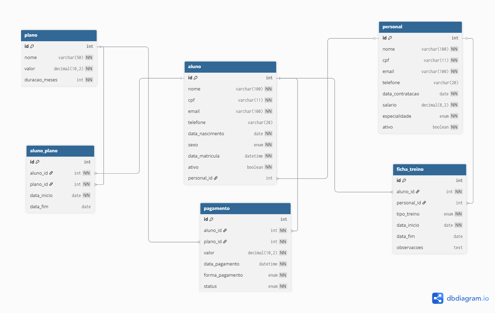

# mysql-academia

Sistema de gestão de uma academia modelado em MySQL, com foco em modelagem relacional, integridade referencial e queries de negócio.



---

## Sobre o projeto

Esse é um projeto pessoal de estudo construído logo após concluir um curso de MySQL. A ideia foi sair da teoria e aplicar tudo num cenário real, defensável — porque acredito que aprender SQL de verdade só acontece quando você precisa modelar um domínio do zero e responder perguntas de negócio com queries.

Escolhi o domínio "academia" porque é um sistema que envolve várias decisões interessantes: planos com renovação, pagamentos mensais, histórico de matrículas, fichas de treino, vínculos opcionais (aluno pode ou não ter personal trainer). Cada uma dessas particularidades exige uma decisão de modelagem com trade-off real — e era exatamente isso que eu queria praticar.

---

## Tecnologias

- **MySQL 8+** (motor InnoDB, charset utf8mb4)
- **MySQL Workbench** para execução e modelagem visual
- **dbdiagram.io** para geração do DER

---

## Estrutura do repositório

```
mysql-academia/
├── README.md
├── .gitignore
├── docs/
│   └── der.png                  # Diagrama entidade-relacionamento
└── sql/
    ├── 01-create-database.sql   # DDL: criação do banco e tabelas
    ├── 02-insert-data.sql       # DML: dados fictícios para teste
    └── 03-queries.sql           # DQL: queries de negócio
```

---

## Modelagem

O banco contém **6 tabelas** representando o domínio de uma academia de pequeno porte:

| Tabela | Papel |
|---|---|
| `plano` | Catálogo de planos oferecidos (Mensal, Semestral, Anual) |
| `personal` | Cadastro dos personal trainers |
| `aluno` | Cadastro dos alunos, com vínculo opcional a um personal |
| `aluno_plano` | Tabela associativa — histórico de planos contratados por aluno |
| `pagamento` | Registro financeiro de pagamentos realizados |
| `ficha_treino` | Fichas de treino dos alunos |

---

## Decisões de modelagem

Essa é a seção onde quero explicar o **porquê** das escolhas, não só o que foi feito. Cada decisão dessas precisa ser defendida — então deixo registrada a razão.

### A entidade "Academia" foi cortada

Em vez de criar uma tabela `academia` com uma única linha, considerei que o banco serve a uma academia específica (sistema mono-tenant). Dados como nome, endereço e CNPJ ficam como configuração do sistema, não como entidade.

### Histórico de planos via tabela associativa

A relação `Aluno × Plano` poderia ser modelada como 1:N simples (aluno tem um plano atual). Optei por N:N com tabela associativa `aluno_plano` para preservar o histórico — assim a query "quais alunos já trocaram de plano?" se torna possível, e dados como tempo médio de retenção podem ser extraídos.

O vínculo vigente é identificado por `data_fim IS NULL`, evitando uma coluna booleana adicional que precisaria ser mantida sincronizada.

### Pagamento referencia tanto aluno quanto plano

Decisão tomada para preservar a integridade do histórico financeiro: se um aluno troca de plano, cada pagamento ainda sabe a qual plano se referia no momento em que foi feito. Sem isso, relatórios contábeis ficariam ambíguos.

### Regras de `ON DELETE` pensadas caso a caso

Cada foreign key tem uma regra de deleção diferente, conforme o significado do relacionamento:

- `aluno.personal_id` → **SET NULL**: se um personal sai da academia, os alunos dele continuam existindo, só ficam sem vínculo (e a coluna é nullable para suportar isso).
- `pagamento.aluno_id` e `pagamento.plano_id` → **RESTRICT**: pagamento é registro financeiro. Não se apaga aluno nem plano que tenham histórico de pagamento — o ideal é usar soft delete via campo `ativo`.
- `aluno_plano.aluno_id` → **CASCADE**: se o aluno é apagado, o histórico de matrículas dele perde sentido isolado.
- `ficha_treino.aluno_id` → **CASCADE** | `ficha_treino.personal_id` → **SET NULL**: mesma lógica.

Esse desenho garante que o banco protege a integridade contábil, mas permite manutenção operacional onde faz sentido.

### Uso de ENUM para listas fixas

Especialidade de personal, tipo de treino, forma de pagamento e status — todas modeladas como `ENUM`. O critério: lista pequena, fixa, sem atributos próprios. Isso evita inconsistências como "Musculação" e "musculaçao" coexistindo no banco.

Em uma evolução futura, especialidade e tipo de treino poderiam virar uma tabela `modalidade` separada se a lista crescer ou ganhar atributos (descrição, intensidade, equipamento).

### `DECIMAL` para todo valor monetário

Valores como `plano.valor`, `personal.salario` e `pagamento.valor` usam `DECIMAL` em vez de `FLOAT` ou `INT`. `FLOAT` tem erro de arredondamento binário (inaceitável em sistema financeiro), e `INT` exigiria conversão constante para centavos.

### Soft delete via campo `ativo`

Tanto `aluno` quanto `personal` têm campo `ativo BOOLEAN DEFAULT TRUE`. Quando alguém sai da academia, o registro não é apagado — apenas marcado como inativo. Isso preserva histórico e atende ao padrão da indústria (e a obrigações fiscais e da LGPD em sistemas reais).

---

## O que esse projeto pratica

O conteúdo do banco foi pensado para permitir queries que cobrem o essencial do que se espera de um desenvolvedor que trabalha com MySQL:

- **DDL completa**: `CREATE TABLE`, constraints (NOT NULL, UNIQUE, DEFAULT, CHECK), foreign keys com `ON DELETE`/`ON UPDATE` explícitos, ENUMs, charset utf8mb4 e engine InnoDB.
- **DML com cenários realistas**: dados que cobrem caminhos felizes (aluno paga em dia) e casos limítrofes (inadimplência, estorno, cancelamento, troca de plano, aluno sem personal, aluno sem ficha cadastrada).
- **DQL variada**: SELECT com filtros, agregações (COUNT, SUM, AVG, MAX, MIN), GROUP BY com HAVING, INNER JOIN, LEFT JOIN (incluindo padrão anti-join), subqueries escalares e aninhadas, funções de data e CASE WHEN.

O arquivo `03-queries.sql` traz queries pensadas como perguntas de negócio reais — não exercícios isolados de sintaxe.

---

## Exemplos de queries notáveis

### Faturamento mensal de 2025

```sql
SELECT MONTH(data_pagamento) AS mes, 
       SUM(valor) AS faturamento
FROM pagamento
WHERE status = 'pago'
  AND YEAR(data_pagamento) = 2025
GROUP BY MONTH(data_pagamento)
ORDER BY mes ASC;
```

### Alunos sem ficha de treino cadastrada (anti-join)

```sql
SELECT a.nome
FROM aluno a
LEFT JOIN ficha_treino f ON a.id = f.aluno_id
WHERE f.id IS NULL;
```

### Plano vigente de cada aluno ativo

```sql
SELECT a.nome AS aluno, pl.nome AS plano, ap.data_inicio
FROM aluno a
JOIN aluno_plano ap ON a.id = ap.aluno_id
JOIN plano pl ON ap.plano_id = pl.id
WHERE ap.data_fim IS NULL
  AND a.ativo = TRUE
ORDER BY a.nome;
```

---

## Aprendizados técnicos

Algumas coisas que esse projeto consolidou na prática (e que eu não tinha tão claras antes de começar):

- **A regra do "FK fica no lado muitos"** parece simples até você ter três FKs na mesma tabela e precisar pensar em cada uma separadamente. Modelar `aluno_plano` me forçou a entender o porquê.
- **`ON DELETE` não é decisão técnica, é decisão de negócio.** Cada foreign key teve que ser pensada com a pergunta "o que deveria acontecer com o filho quando o pai sumir?" — e a resposta muda completamente conforme o domínio.
- **Bug silencioso é mais perigoso que erro de sintaxe.** Aprendi isso na prática construindo as queries: um INNER JOIN no lugar errado retorna zero linhas sem reclamar; um JOIN a mais duplica resultados sem aviso. Conferir contagem esperada virou hábito.
- **Tempo do sistema × tempo do domínio.** `DEFAULT CURRENT_TIMESTAMP` faz sentido para "quando o registro entrou no sistema" (auditoria), mas não para eventos do mundo real que aconteceram antes do INSERT (pagamento, contratação). Distinção que não estava no curso e que me ajudou a entender o porquê de bugs em sistemas reais.
- **HAVING × WHERE.** A diferença "antes ou depois do agrupamento" só fixou de vez quando precisei usar HAVING numa query e tentei resolver com WHERE primeiro — e quebrei.

---

## Sobre o curso que serviu de base

Os fundamentos vieram de um curso de MySQL que estou estudando como parte do meu plano de aprendizado. Saber SQL é praticamente requisito de qualquer vaga de desenvolvimento backend hoje — quase todo sistema persiste dados em banco relacional, e queries são o que diferenciam código que funciona de código que escala. Por isso, em vez de só assistir o curso e fazer exercícios fechados, decidi aplicar o conteúdo num projeto que eu pudesse defender em entrevista. Modelar do zero, errar, reconsiderar e justificar cada escolha — esse foi o foco aqui.

---

## Possíveis evoluções

Mantive o escopo enxuto de propósito, mas algumas direções para continuar:

- Separar exercícios da ficha de treino em tabela `exercicio_ficha` (atualmente são descritos em texto livre na coluna `observacoes`).
- Substituir os ENUMs de especialidade e tipo de treino por uma tabela `modalidade` se a lista crescer.
- Adicionar coluna `created_at`/`updated_at` em todas as tabelas para auditoria completa.
- Implementar uma API REST consumindo esse banco (provavelmente em PHP ou Java, dependendo do contexto).
- Apontar `pagamento` para `aluno_plano` em vez de `aluno` + `plano` separadamente, ganhando rastreabilidade do vínculo exato.
